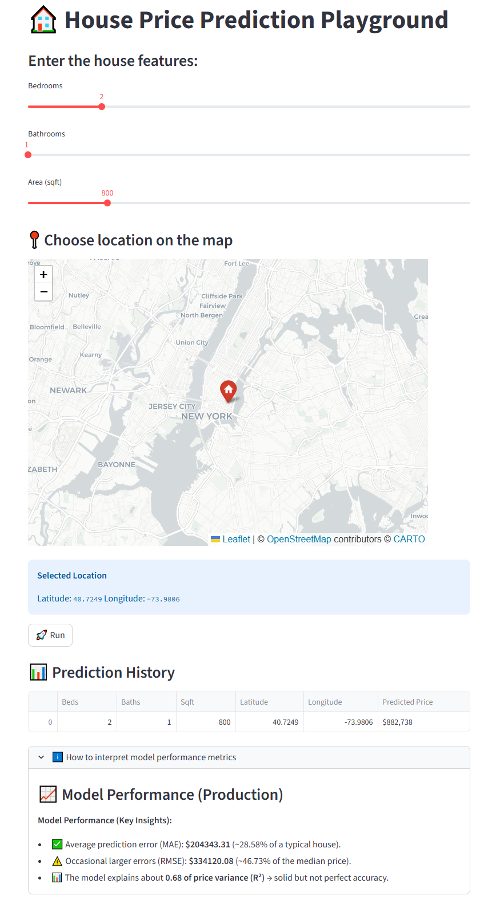

# 🏠 House Price Prediction Playground

Playground allows you to test the **production model** for house price prediction.  
You can adjust property features (bedrooms, bathrooms, square footage) and choose a location on the map to generate predictions.  

---

???+ info "🎮 How It Works"
    1. Select the **number of bedrooms, bathrooms, and property size** using sliders.  
    2. Click on the **map** to choose the property’s location (latitude/longitude).  
    3. Run the model → the system predicts the house price and displays it.  
    4. Each prediction is saved into a **history table** for comparison.  

---

???+ info "📍 Location Selection"
    A map (powered by **Folium + CartoDB**) allows you to select any location in New York.  
    - Click once on the map to drop a marker.  
    - The latitude and longitude are displayed.  
    - This geo-information is sent to the model alongside structural features.  

    ✅ Example of selected coordinates:  
    - Latitude: `40.7128`  
    - Longitude: `-74.0060`  

---

???+ info "📊 Prediction History"
    All previous predictions during a session are stored in a history table.  

    | Beds | Baths | Sqft | Latitude | Longitude | Predicted Price |
    |------|-------|------|----------|-----------|-----------------|
    | 2    | 1     | 800  | 40.7128  | -74.0060  | $350,000       |

    This helps compare different configurations and explore “what-if” scenarios.

---

# ---- Model Performance Section ----

???+ info "📈 Model Performance (Production)"
    The playground provides insights into the **production model’s performance metrics**.  

    **Key Metrics:**  
    - **MAE (Median):** Average prediction error in USD.  
    - **RMSE (Median):** Typical error scale in USD.  
    - **R² (Explained Variance):** How well the model captures price variance.  

    These metrics help evaluate the model’s reliability and accuracy.

---

# ✅ Key Takeaways

- You can **interactively test the production model** with custom inputs.  
- Location is selected directly on a map for realistic pricing experiments.  
- A **history table** stores previous runs for side-by-side comparison.  
- Model performance metrics are available to contextualize predictions.  

---
